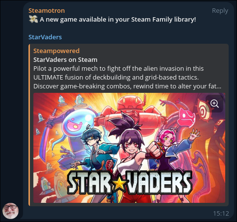

# steam-purchase-notifier 🔔
Watch a Steam account purchases through notifications

<p align="center">
  
</p>

## Dev notes
I wanted to let my Steam Family members know when I buy a new game so I made this little tool :]

## How to use
### Prerequisites
- `go >= 1.25.4`

The following env vars (you can use an `.env` file):
- `STEAM_API_KEY` **(required)** Your Steam API key
- `STEAM_IDS` **(required)** The accounts Steam ID you want to monitor, multiple Steam IDs are supported (separated by comma)
- `TELEGRAM_BOT_TOKEN` Your Telegram bot token for notifications
- `TELEGRAM_CHAT_ID` The Telegram chat ID the bot will send messages to
- `DISCORD_BOT_TOKEN` Your Discord bot token for notifications
- `DISCORD_CHANNEL_ID` The Discord channel ID the bot will send messages to

### Run
```bash
go run main.go [--telegram | --discord]
```

### Schedule

Run the script regularly to watch for updates (e.g.: a crontab):
```crontab
# Every 10 minutes
*/10 * * * * /usr/local/go/bin/go -C /home/gobtronic/steam-purchase-notifier run ./main.go >> /home/gobtronic/steam-purchase-notifier/cron.log 2>&1
```

## How it works
- Call the Steam API to retrieve the `STEAM_IDS` owned games (the profile must be public!)
- Compare the list of app IDs with the ones in `./gamelist.json` (if it already exists)
  - If there are new IDs: call the notifier with each game to send a notification
- And finally write the app IDs to `./gamelist.json`

## Developers
See `internal/port` for interfaces.

You could for example implement the `Notifier` interface to notify with something else than a Telegram bot. Or the `GameStore` interface to store the cached app IDs in a sqlite db.
